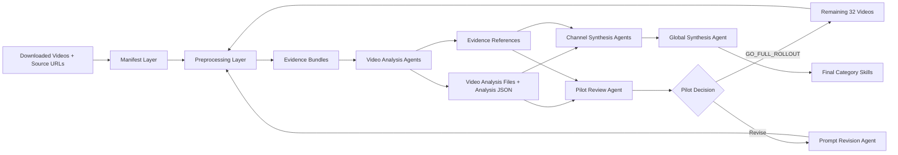
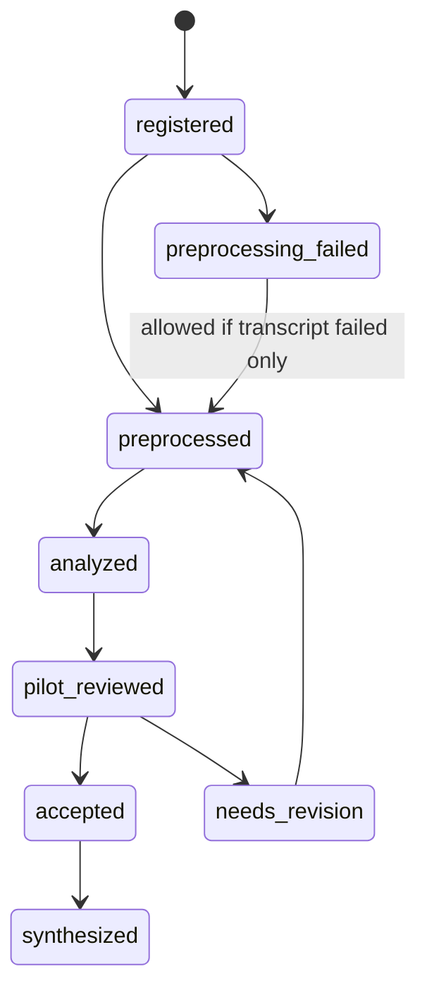
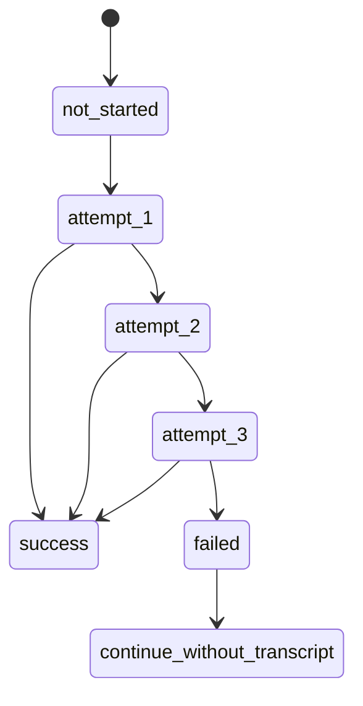

# Video Skill Data Pipeline Architecture

## 1. Purpose

This architecture defines a staged system for learning reusable video-production skills from a curated dataset of short Instagram/Reels-style Video Samples. The system converts downloaded videos into deterministic Evidence Bundles, uses AI agents to extract timestamped observations, preserves proof through Evidence References, and synthesizes final Category Skills backed by source evidence.

The pipeline is designed to solve four problems:

1. Raw video analysis consumes too much context.
2. Generic multimodal prompting produces vague editing advice.
3. Early agents overgeneralize from too little evidence.
4. Final skills are only useful if they cite timestamped proof.

The system therefore separates preprocessing, per-video evidence collection, channel synthesis, global skill synthesis, and pilot review into distinct phases with explicit artifacts.

## 2. Core Architecture



## 3. Architectural Principles

### 3.1 Evidence Before Interpretation

Every Video Sample is transformed into an Evidence Bundle before AI analysis. The Evidence Bundle gives agents compact, stable artifacts instead of forcing them to repeatedly inspect raw video.

Video Analysis Agents use Evidence Bundles first. They may inspect the raw local video only for targeted Zoom-In Verification at a specific timestamp.

Required Evidence Bundle artifacts:

- `transcript.json`, when Proactor succeeds.
- `transcript_meta.json`.
- `frame_grid_1fps.jpg`.
- `scene_changes.json`.
- `audio_peaks.json`.
- `keyframes/`.
- `video_index.json`.

### 3.2 Video Agents Collect Evidence Only

Video Analysis Agents do not make cross-video conclusions, cross-channel conclusions, or final skill rules. They only record what happened in assigned videos and create Evidence References for important observations.

### 3.3 Synthesis Happens After Evidence Stabilizes

Channel Synthesis Agents read completed video outputs from one channel. The Global Synthesis Agent reads channel/category evidence and creates final Category Skills.

Channel Synthesis is mandatory before Global Synthesis. Global Synthesis should not jump directly from per-video analysis files to final Category Skills because that would blur video-level evidence, channel-level repetition, and cross-channel reusable rules.

### 3.4 Category Skills Are Final, Channel Profiles Are Intermediate

The system does not produce final channel-clone skills. Channel Profiles are used only to inform per-category skill synthesis.

### 3.5 Pilot Run Protects The Full Dataset

The first 8 videos are diagnostic: two per channel. The Pilot Review Agent identifies weaknesses in prompts, preprocessing, schemas, weighting, and Evidence Reference quality before the remaining 32 videos are processed.

## 4. Dataset Scale

Initial target:

```text
4 channels
10 videos per channel
3 minutes max per video
40 videos total
```

Pilot target:

```text
4 channels
2 videos per channel
8 videos total
```

Full rollout target:

```text
remaining 32 videos
```

## 5. Channel And Category Model

### 5.1 Channels

Current channel set:

1. Channel 1: Upgrido / Retro Doc.
2. Channel 2: 100X engineers.
3. Channel 3: Aevy TV.
4. Channel 4: VarunMaya.

Each channel has:

- `channel_id`.
- display name.
- Extraction Mission.
- prompt module.
- category weights.
- selected Video Samples.

### 5.2 Categories

Final skills are produced for these six categories:

1. How to Select Assets.
2. Sourcing Great Assets.
3. What Makes a Good Video.
4. Editing Framework / Layout.
5. Sound Design Sync.
6. Data & Text Density.

### 5.3 Weight Depth Rules

```text
weight >= 8.0
  primary extraction category
  deep extraction required

weight 6.5-7.9
  optional extraction category
  include only when strong evidence appears

weight < 6.5
  low priority category
  ignore unless exceptional
```

### 5.4 Weighting Matrix v1

| Category | Upgrido / Retro Doc | 100X engineers | Aevy TV | VarunMaya |
|---|---:|---:|---:|---:|
| How to Select Assets | 9.0 | 7.0 | 8.0 | 8.5 |
| Sourcing Great Assets | 9.5 | 8.0 | 7.5 | 8.5 |
| What Makes a Good Video | 6.5 | 9.5 | 8.5 | 9.0 |
| Editing Framework / Layout | 7.5 | 9.0 | 8.0 | 9.5 |
| Sound Design Sync | 7.0 | 9.5 | 8.0 | 9.0 |
| Data & Text Density | 6.0 | 9.5 | 8.5 | 9.0 |

## 6. Folder Architecture

Recommended root layout:

```text
video_skill_pipeline/
  manifest/
    channels.json
    videos.json
    weighting_matrix_v1.json
    runs.json

  input_videos/
    channel_1_upgrido_retro_doc/
      channel_1_video_001.mp4

  evidence/
    channel_1_upgrido_retro_doc/
      channel_1_video_001/
        transcript.json
        transcript_meta.json
        frame_grid_1fps.jpg
        scene_changes.json
        audio_peaks.json
        keyframes/
        video_index.json
        references/

  analysis/
    channel_1_upgrido_retro_doc/
      channel_1_video_001.md

  analysis_json/
    channel_1_upgrido_retro_doc/
      channel_1_video_001.json

  pilot/
    pilot_review.md
    pilot_review.json
    pipeline_improvement_plan.md
    prompt_patch_plan.md
    schema_patch_plan.md
    weighting_matrix_feedback.md

  synthesis/
    channel_profiles/
    category_patterns/
    skills/

  prompts/
    base-video-analysis-prompt.md
    categories/
    channels/
    pilot/
    synthesis/
    terms/
```

## 7. Manifest Layer

The manifest layer should be treated as the source of truth once implemented. Folder scanning can validate paths, but it should not silently invent dataset records.

For v1, manifest authoring is generated from Instagram JSON exports using `scripts/import_instagram_reels.py`. The source exports provide `url`, owner metadata, captions, thumbnails, counts, and timestamps. The script converts those records into explicit manifest entries, assigns stable Video IDs, extracts Platform IDs from Instagram URLs, creates a reproducible random pilot split, and writes local file paths under `input_videos/{channel_id}/`.

Local video location:

```text
input_videos/{channel_id}/{video_id}.mp4
```

Source URL mapping is generated from the JSON export `url` field. Records without a usable Instagram URL are invalid for v1 import.

### 7.1 `channels.json`

Purpose: define channel-level metadata, prompt modules, and extraction missions.

```json
{
  "channels": [
    {
      "channel_id": "channel_1_upgrido_retro_doc",
      "display_name": "Upgrido / Retro Doc",
      "extraction_mission": "Learn asset selection and asset sourcing for premium retro/documentary-style videos.",
      "prompt_module": "prompts/channels/channel-1-upgrido-retro-doc.md",
      "status": "active"
    }
  ]
}
```

### 7.2 `videos.json`

Purpose: define every Video Sample and its provenance.

```json
{
  "videos": [
    {
      "video_id": "channel_1_video_001",
      "channel_id": "channel_1_upgrido_retro_doc",
      "platform": "instagram",
      "platform_id": "REEL_SHORTCODE",
      "source_url": "https://www.instagram.com/reel/REEL_SHORTCODE/",
      "local_file": "input_videos/channel_1_upgrido_retro_doc/channel_1_video_001.mp4",
      "evidence_dir": "evidence/channel_1_upgrido_retro_doc/channel_1_video_001/",
      "analysis_file": "analysis/channel_1_upgrido_retro_doc/channel_1_video_001.md",
      "analysis_json": "analysis_json/channel_1_upgrido_retro_doc/channel_1_video_001.json",
      "dataset_split": "pilot",
      "status": "registered"
    }
  ]
}
```

### 7.3 `weighting_matrix_v1.json`

Purpose: define category weights and preserve version history.

```json
{
  "version": "v1",
  "categories": [
    "asset_selection",
    "asset_sourcing",
    "good_video_principles",
    "editing_layout",
    "sound_design_sync",
    "data_text_density"
  ],
  "weights": {
    "channel_1_upgrido_retro_doc": {
      "asset_selection": 9.0,
      "asset_sourcing": 9.5,
      "good_video_principles": 6.5,
      "editing_layout": 7.5,
      "sound_design_sync": 7.0,
      "data_text_density": 6.0
    }
  }
}
```

### 7.4 `runs.json`

Purpose: track execution runs, pilot decisions, matrix versions, and prompt versions.

```json
{
  "runs": [
    {
      "run_id": "pilot_v1_001",
      "run_type": "pilot",
      "weighting_matrix_version": "v1",
      "prompt_version": "v1",
      "video_ids": [
        "channel_1_video_001",
        "channel_1_video_002"
      ],
      "status": "pending",
      "created_at": "2026-06-03T00:00:00+05:30"
    }
  ]
}
```

## 8. Preprocessing Layer

### 8.1 Responsibilities

Preprocessing creates Evidence Bundles before AI interpretation.

Responsibilities:

- Validate local video file exists.
- Extract transcript through Proactor automation.
- Generate visual frame grid.
- Detect scene changes.
- Detect audio peaks.
- Extract keyframes.
- Build merged video index.
- Record success/failure metadata.

V1 local preprocessing tools:

```text
FFmpeg + Python helper scripts
```

FFmpeg extracts deterministic media signals such as frames, keyframes, audio data, and duration. Python helpers assemble pipeline artifacts such as `frame_grid_1fps.jpg`, `scene_changes.json`, `audio_peaks.json`, and `video_index.json`.

The initial media download and organization helper is:

```text
scripts/import_instagram_reels.py
```

It uses `py -m yt_dlp` to download Instagram media from manifest source URLs into the canonical `input_videos/{channel_id}/` layout.

### 8.2 Transcript Extraction

Transcript Provider:

```text
Proactor Instagram transcript page
```

Policy:

```text
attempt 1: try Proactor
attempt 2: retry Proactor if failed
attempt 3: retry Proactor if failed
after 3 failures: mark Transcript Failure
fallback provider: none
analysis policy: continue without transcript
```

`transcript_meta.json` success form:

```json
{
  "provider": "proactor",
  "status": "success",
  "attempts": 1,
  "source_url": "https://www.instagram.com/reel/REEL_SHORTCODE/",
  "fallback_provider": null,
  "analysis_policy": "use_transcript",
  "transcript_artifact": "transcript.json",
  "timestamped": true,
  "created_at": "2026-06-03T00:00:00+05:30"
}
```

`transcript.json` form:

```json
{
  "video_id": "channel_1_video_001",
  "provider": "proactor",
  "timestamped": true,
  "segments": [
    {
      "start": "00:00.0",
      "end": "00:03.2",
      "text": "Example transcript segment."
    }
  ]
}
```

`transcript_meta.json` failure form:

```json
{
  "provider": "proactor",
  "status": "failed",
  "attempts": 3,
  "source_url": "https://www.instagram.com/reel/REEL_SHORTCODE/",
  "fallback_provider": null,
  "analysis_policy": "continue_without_transcript",
  "error": "No usable transcript after three attempts",
  "created_at": "2026-06-03T00:00:00+05:30"
}
```

### 8.3 Frame Grid

Purpose: give the agent a compact visual timeline.

Recommended default:

```text
1 frame per second
3-minute video = about 180 frames
combine into a readable contact sheet
```

Output:

```text
frame_grid_1fps.jpg
```

### 8.4 Scene Changes

Purpose: identify likely edit points, layout shifts, visual resets, and candidate Timeline Segments.

Output:

```json
[
  {
    "timestamp": "00:12.4",
    "change_type": "hard_cut",
    "confidence": 0.91
  }
]
```

### 8.5 Audio Peaks

Purpose: identify sound events that may sync with cuts, asset pops, text changes, reveals, or layout transitions.

Output:

```json
[
  {
    "timestamp": "00:09.2",
    "event_type": "audio_peak",
    "intensity": 0.78
  }
]
```

### 8.6 Keyframes

Purpose: preserve frames around important events.

Initial keyframes can be broad:

```text
keyframes/
  scene_001_before.jpg
  scene_001_at.jpg
  scene_001_after.jpg
```

Focused Evidence References are created later by Video Analysis Agents.

### 8.7 Video Index

Purpose: merge transcript, scene changes, audio peaks, and keyframes into a single timeline.

```json
{
  "video_id": "channel_1_video_001",
  "duration_seconds": 178.4,
  "transcript_status": "success",
  "timeline_events": [
    {
      "timestamp": "00:12.4",
      "visual_change": "hard_cut",
      "audio_peak": true,
      "nearby_transcript": "This is why the old visual fails...",
      "candidate_categories": [
        "asset_selection",
        "editing_layout"
      ]
    }
  ]
}
```

## 9. Agent Layer

### 9.1 Agent Overview

| Agent | Reads | Writes | Forbidden |
|---|---|---|---|
| Video Analysis Agent | Manifest record, Evidence Bundle, prompt stack | `analysis.md`, `analysis.json`, Evidence References | Cross-video conclusions, final skills |
| Channel Synthesis Agent | Analysis files for one channel | Channel Profile Markdown and JSON | Final Category Skills |
| Global Synthesis Agent | Channel Profiles, analysis JSON, Evidence References | Final Category Skills | Unsupported rules |
| Pilot Review Agent | Pilot outputs and prompt system | Review reports and improvement plans | Direct dataset edits |
| Prompt Revision Agent | Pilot review outputs and prompt files | Prompt patch plans and prompt revisions | Vague changes not tied to failures |

### 9.2 Prompt Assembly

Video Analysis Agent prompt stack:

```text
1. Base video analysis prompt
2. Category framework
3. Channel-specific module
4. Video manifest record
5. Evidence bundle paths
6. Weighting matrix version
```

### 9.3 Video Analysis Agent Contract

Input:

- One Analysis Batch.
- One or more Video Samples from the same channel.
- Evidence Bundle per video.
- Channel module.
- Category framework.
- Raw local video only for targeted Zoom-In Verification.

Output:

- One Video Analysis File per video.
- One analysis JSON per video.
- 5-12 Evidence References per video.

Hard boundaries:

- No cross-video claims.
- No cross-channel claims.
- No final skill claims.
- No invented narration when transcript failed.
- No low-weight category stuffing.
- No broad full-video inspection before using the Evidence Bundle.

### 9.4 Channel Synthesis Agent Contract

Input:

- All completed per-video outputs for one channel.
- Cited Evidence References.
- Weighting Matrix version.

Output:

- `synthesis/channel_profiles/{channel_id}.md`.
- `synthesis/channel_profiles/{channel_id}.json`.

Purpose:

- Summarize repeated channel patterns.
- Identify strongest category evidence.
- Record limits and transcript issues.
- Feed global category synthesis.

### 9.5 Global Synthesis Agent Contract

Input:

- Channel profiles.
- Analysis JSON.
- Evidence References.
- Weighting Matrix version history.

Output:

- `asset_selection_skill.md`.
- `asset_sourcing_skill.md`.
- `good_video_principles_skill.md`.
- `editing_layout_skill.md`.
- `sound_design_sync_skill.md`.
- `data_text_density_skill.md`.

V1 final Category Skills are Markdown skill specs under `synthesis/skills/`. Conversion into Codex or Claude skill directories is a later step after evidence-backed rules mature.

V1 Category Skill files are prompt-style skill specs, not executable skill directories. They should contain purpose, when to use, evidence-backed rules, examples or patterns, confidence and limits, Evidence References, and an optional clearly marked future automation hooks section.

Rules:

- Every major rule needs Evidence References.
- Conflicting evidence must be conditionalized.
- Channel style must not become the final output.
- Generic editing advice is unacceptable unless backed by dataset evidence.
- Global Synthesis must run after Channel Synthesis, not instead of it.
- Overlapping rules should have one primary Category Skill home and may be cross-referenced from related categories.
- Full duplicate rules are allowed only when the rule meaning changes by category, and the duplication must be explained.
- Conflicting channel evidence should become conditional guidance instead of being flattened into one universal rule.

### 9.6 Pilot Review Agent Contract

Input:

- 8 pilot analysis Markdown files.
- 8 pilot analysis JSON files.
- Evidence References.
- Evidence Bundles.
- Prompt files.
- Weighting Matrix version.

Output:

- `pilot_review.md`.
- `pilot_review.json`.
- `pipeline_improvement_plan.md`.
- `prompt_patch_plan.md`.
- `schema_patch_plan.md`.
- `weighting_matrix_feedback.md`.

Decision values:

- `GO_FULL_ROLLOUT`.
- `REVISE_PROMPTS`.
- `FIX_PREPROCESSING`.
- `FIX_SCHEMA`.
- `REWEIGHT_MATRIX`.
- `STOP_PIPELINE`.

### 9.7 Prompt Revision Agent Contract

Input:

- Pilot Review Agent outputs.
- Current prompts.
- Examples of weak outputs.

Output:

- Prompt revision plan.
- Revised prompt files, only if the planned change is tied to pilot evidence.

Rules:

- Patch base prompt only for global failures.
- Patch channel modules for channel-specific failures.
- Patch category framework for category misunderstanding.
- Patch output contract for synthesis-readability failures.
- Never ask agents to guess missing evidence.

## 10. Video Analysis Output Contract

### 10.1 Markdown Analysis File

```md
# Video Analysis: {video_id}

Channel: {channel_id}
Platform ID: {platform_id}
Weighting Matrix Version: {weighting_matrix_version}
Transcript Status: {success|failed}

## Evidence Availability

## Segment Discovery Summary

## Deep Observations

## Category Coverage

## JSON Summary
```

### 10.2 Analysis JSON

The v1 schema has two layers:

1. Fixed fields: mandatory fields required for validation and downstream synthesis.
2. Flexible fields: regulated extension notes that can carry extra useful observations without changing the core schema.

Flexible fields must remain structured enough to avoid downstream parsing problems. They may include extra notes, edge cases, uncertainties, synthesis hints, schema gaps, or agent-specific observations, but they must not replace required fields or introduce unsupported final skill claims. Global synthesis may inspect extension notes as supporting context, but primary synthesis evidence still comes from validated observations and Evidence References.

```json
{
  "video_id": "",
  "channel_id": "",
  "platform_id": "",
  "weighting_matrix_version": "",
  "transcript_status": "success",
  "evidence_availability": {
    "transcript": true,
    "frame_grid": true,
    "scene_changes": true,
    "audio_peaks": true,
    "keyframes": true,
    "video_index": true
  },
  "observations": [
    {
      "observation_id": "obs_001",
      "timestamp": "00:00.0",
      "category": "sound_design_sync",
      "category_weight": 9.5,
      "evidence_confidence": 0.85,
      "summary": "",
      "what_happens": "",
      "why_it_matters": "",
      "evidence_reference": "",
      "source_evidence": {
        "frames": [],
        "audio_markers": [],
        "transcript_window": ""
      },
      "limits": ""
    }
  ],
  "category_coverage": {
    "asset_selection": [],
    "asset_sourcing": [],
    "good_video_principles": [],
    "editing_layout": [],
    "sound_design_sync": [],
    "data_text_density": []
  },
  "agent_boundary_check": {
    "cross_video_claims": false,
    "cross_channel_claims": false,
    "final_skill_claims": false
  },
  "extensions": {
    "notes": [
      {
        "note_id": "note_001",
        "type": "uncertainty",
        "timestamp": "00:00.0",
        "text": "",
        "evidence_reference": "",
        "related_observation_id": "obs_001"
      }
    ]
  }
}
```

## 11. Evidence Reference Contract

Evidence References are focused proof packages created during video analysis.

V1 generation split:

- Video Analysis Agents select the important teachable timestamps and explain which evidence windows are needed.
- The local helper/orchestration layer assembles the Evidence Reference folder from those timestamps.

Agents should identify what deserves a reference. Local helpers should extract before/at/after frames, audio windows, and transcript windows reliably.

Recommended structure:

```text
evidence/{channel_id}/{video_id}/references/
  ref_001_sound_synced_layout_shift/
    reference.md
    before.jpg
    at.jpg
    after.jpg
    audio_window.json
    transcript_window.json
```

`reference.md` form:

```md
# Evidence Reference: {short_name}

Video ID: {video_id}
Channel ID: {channel_id}
Timestamp: {timestamp}
Category: {category}
Observation ID: {observation_id}

## What Happens

## Why It Matters

## Source Files

## Confidence And Limits
```

Rules:

- Create references only for teachable moments.
- Do not create references for every cut.
- Prefer 5-12 references per 3-minute video.
- Include audio and transcript windows only when relevant.
- If transcript failed, do not create transcript windows or infer narration.

## 12. Pilot Architecture

### 12.1 Pilot Selection

Pilot scope:

```text
2 videos per channel
8 total videos
```

Pilot analysis batch rule:

```text
1 Video Analysis Agent per Video Sample
```

The pilot uses one-video analysis batches so prompt, preprocessing, schema, and video-specific failures are easier to diagnose. After the pilot proves stable, full rollout may use small batches of 2-3 videos per agent if context allows.

Pilot selection strategy:

```text
random 2 Video Samples per channel
```

Random selection is acceptable for v1 because the current channel sets are expected to contain similar kinds of videos within each channel.

### 12.2 Pilot Quality Gates

The Pilot Review Agent can approve full rollout only if:

- Required files exist for every pilot video.
- Transcript success or failure is correctly recorded.
- Analysis JSON validates.
- Every video has 5-12 Evidence References.
- High-weight categories have enough evidence.
- Video agents avoided cross-video and cross-channel conclusions.
- Missing-transcript videos did not invent narration.
- Evidence References prove the observations they support.
- Average evidence confidence is at least 0.75.

All hard gates must pass before full rollout. Minor warnings are allowed only when they do not threaten full-rollout quality, evidence integrity, schema validity, or agent-boundary compliance.

### 12.3 Pilot Failure Interpretation

Pilot failures should be mapped to pipeline weaknesses:

| Failure | Likely Fix |
|---|---|
| Vague observations | Revise base prompt or category definitions |
| Wrong category focus | Revise channel module or Weighting Matrix |
| Weak Evidence References | Revise reference creation instructions |
| JSON unreadable | Revise schema contract |
| Transcript failure unclear | Fix preprocessing metadata |
| Cross-video claims | Tighten Video Analysis Agent boundary |
| Low confidence everywhere | Improve Evidence Bundle artifacts |

### 12.4 Pilot Outputs

```text
pilot/
  pilot_review.md
  pilot_review.json
  pipeline_improvement_plan.md
  prompt_patch_plan.md
  schema_patch_plan.md
  weighting_matrix_feedback.md
```

If the pilot fails, failed pilot outputs are preserved as diagnostic artifacts. Revised prompts, schemas, preprocessing, or analysis outputs should be written as a separate rerun set instead of overwriting the failed outputs.

## 13. State Model

The v1 pipeline uses one local Pipeline Orchestrator to own stage state. Agents operate through bounded Agent Packets and validated output folders; they do not independently decide which stage runs next.

The Pipeline Orchestrator controls:

1. manifest validation.
2. preprocessing.
3. Agent Packet assembly.
4. Video Analysis Agent dispatch or queueing.
5. analysis JSON and Evidence Reference validation.
6. Pilot Review Agent execution.
7. Prompt Revision Agent execution when pilot findings require it.
8. full rollout after approval.
9. Channel Synthesis Agent execution.
10. Global Synthesis Agent execution.

Stage transitions are driven by explicit artifacts such as validation reports and `pilot_review.json`, not by implicit agent judgment.

### 13.1 Video State



### 13.2 Transcript State



### 13.3 Run State

```text
created
validated
preprocessing_running
analysis_running
pilot_review_running
approved_for_rollout
blocked_for_revision
full_rollout_running
synthesis_running
complete
```

## 14. Quality And Reliability Rules

### 14.1 Evidence Integrity

- Every observation must have a timestamp.
- Every major observation must cite an Evidence Reference.
- Evidence Confidence must drop when evidence types are missing.
- Missing transcripts must be visible in Markdown and JSON.
- Agents must explicitly state uncertainty.

### 14.2 Anti-Hallucination Rules

- Do not infer spoken content from visuals.
- Do not infer asset source unless visible or stated.
- Do not claim a channel pattern from a single video.
- Do not create final skill rules during video analysis.
- Do not fill low-weight categories with weak observations.

### 14.3 Synthesis Rules

- A final Category Skill rule should have multiple Evidence References when possible.
- Single-reference rules must be labeled lower confidence.
- Conflicting channel evidence must become conditional guidance.
- Repeated weak observations should not become a strong rule.
- Channel-specific flavor should not become universal skill behavior.
- Duplicate or overlapping final rules must be assigned one primary category home with cross-references from related skills.

## 15. Testing Architecture

### 15.1 Manifest Tests

Validate:

- required IDs exist.
- source URL exists when transcript is required.
- local file exists.
- prompt module exists.
- Weighting Matrix version exists.
- channel ID exists.

### 15.2 Preprocessing Tests

Validate:

- transcript metadata is created.
- transcript attempts are recorded.
- frame grid exists and is non-empty.
- scene changes JSON parses.
- audio peaks JSON parses.
- keyframes folder exists.
- video index references expected artifacts.

### 15.3 Analysis Tests

Validate:

- Markdown file exists per video.
- JSON file exists per video.
- JSON schema validates.
- observation timestamps are valid.
- Evidence Reference paths exist.
- boundary flags are false.
- low-weight categories are not overfilled.

### 15.4 Pilot Review Tests

Validate:

- decision value is one of the allowed values.
- review includes pipeline-level weaknesses.
- review includes prompt/schema/preprocessing feedback when needed.
- review does not directly modify analysis files.

### 15.5 Synthesis Tests

Validate:

- final skills exist for all six categories.
- major rules cite Evidence References.
- no final skill is a channel clone.
- conflicting evidence is handled conditionally.
- v1 final skills do not mix executable automation commands into evidence-backed prompt rules except in a clearly marked future automation hooks section.

## 16. Failure Handling

### 16.1 Transcript Failure

If Proactor fails after three attempts:

- write `transcript_meta.json` with status `failed`.
- do not create `transcript.json`, or create an empty JSON segments file only if clearly marked.
- continue visual/audio analysis.
- reduce confidence for `good_video_principles`.
- prevent narration claims.

### 16.2 Preprocessing Artifact Failure

If local visual/audio artifacts fail:

- block video analysis unless the missing artifact is explicitly optional.
- record failure in run state.
- do not let AI compensate by guessing.

### 16.3 Weak Evidence References

If references do not prove observations:

- Pilot Review Agent should block rollout with `REVISE_PROMPTS` or `FIX_PREPROCESSING`.
- Prompt Revision Agent should patch reference instructions.

### 16.4 Prompt Degradation

If prompt revisions make output worse:

- preserve previous prompt version.
- compare pilot outputs across versions.
- revert or patch narrowly.

## 17. Open Implementation Seams

The main build seams are:

1. Manifest loader and validator.
2. Proactor transcript automation.
3. Local preprocessing artifact generator.
4. Evidence Bundle validator.
5. Video Analysis Agent orchestration.
6. Evidence Reference generator.
7. Analysis JSON validator.
8. Pilot Review Agent runner.
9. Prompt Revision Agent runner.
10. Channel synthesis runner.
11. Global skill synthesis runner.

Highest-value first implementation order:

1. Manifest schema and folder validator.
2. Evidence Bundle generator for one video.
3. Analysis JSON schema validator.
4. Pilot folder scaffold.
5. Video Analysis Agent prompt assembly.
6. Evidence Reference creation helper.
7. Pilot Review Agent.
8. Full rollout runner.
9. Synthesis runners.

## 18. Current Workspace Artifacts

Existing source-of-truth docs:

- `CONTEXT.md`.
- `docs/prd/video-skill-data-pipeline-prd.md`.
- `docs/adr/0001-preprocess-video-evidence-before-ai-analysis.md`.
- `docs/adr/0002-separate-video-evidence-from-synthesis-conclusions.md`.
- `docs/adr/0003-create-evidence-references-during-video-analysis.md`.
- `docs/adr/0004-use-weight-thresholds-to-scope-video-analysis.md`.
- `docs/adr/0005-version-weighting-matrix-revisions.md`.
- `docs/adr/0006-use-pilot-review-to-improve-the-pipeline-before-rollout.md`.

Existing prompt layer:

- `prompts/base-video-analysis-prompt.md`.
- `prompts/categories/category-framework.md`.
- `prompts/channels/`.
- `prompts/pilot/pilot-review-agent-prompt.md`.
- `prompts/pilot/prompt-revision-agent-prompt.md`.
- `prompts/synthesis/channel-synthesis-form.md`.
- `prompts/synthesis/global-category-synthesis-form.md`.
- `prompts/terms/video-analysis-prompt-terms.md`.

## 19. Still-Unresolved Architecture Decisions

These remain unresolved and should be closed before implementation:

1. Exact behavior when future JSON exports contain missing or duplicate Instagram URLs.
2. Whether generated manifests should remain local runtime artifacts or be promoted into tracked dataset metadata.
3. Whether future manifest authoring needs manual review before pipeline registration.
4. Exact Proactor automation selectors and behavior.
5. Exact Proactor extraction mechanism for producing structured timestamped transcript segments.
6. Exact preprocessing helper boundaries and script names.
7. Exact JSON Schema files and validation command.
8. Exact Evidence Reference helper interface for agent-selected timestamps.
9. Exact Pipeline Orchestrator implementation and Agent Packet file schema.
10. Exact mature-pipeline behavior after v1.
11. Exact conversion criteria for turning Markdown Category Skill specs into Codex/Claude skill directories later.
